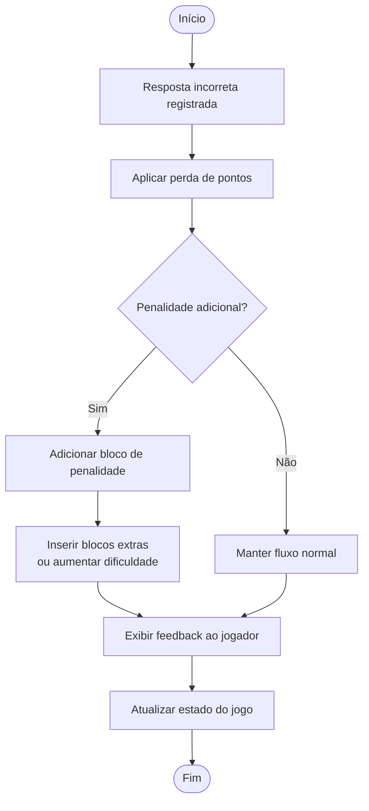

```mermaid
flowchart TD

A([Início]) --> B[Resposta incorreta registrada]

B --> C[Aplicar perda de pontos]

C --> D{Penalidade adicional?}

D -->|Sim| E[Adicionar bloco de penalidade]
E --> F[Inserir blocos extras<br> ou aumentar dificuldade]

D -->|Não| G[Manter fluxo normal]

F --> H[Exibir feedback ao jogador]
G --> H

H --> I[Atualizar estado do jogo]

I --> J([Fim])
```