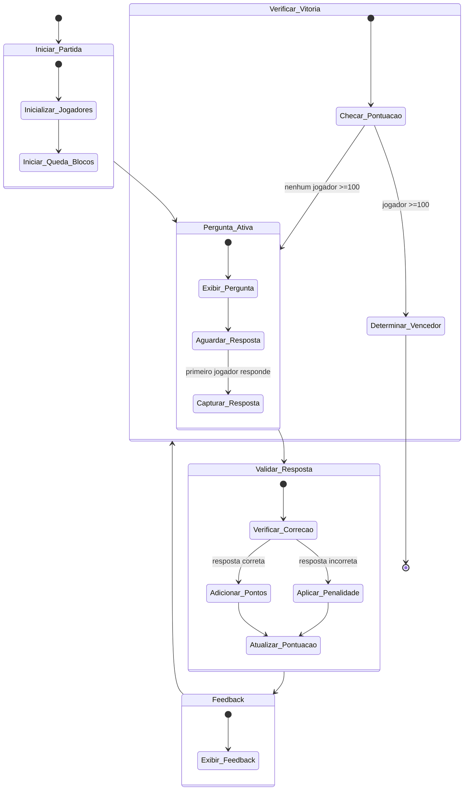

```mermaid
stateDiagram-v2

[*] --> Iniciar_Partida

state Iniciar_Partida {
    [*] --> Inicializar_Jogadores
    Inicializar_Jogadores --> Iniciar_Queda_Blocos
}

Iniciar_Partida --> Pergunta_Ativa

state Pergunta_Ativa {
    [*] --> Exibir_Pergunta
    Exibir_Pergunta --> Aguardar_Resposta
    Aguardar_Resposta --> Capturar_Resposta : primeiro jogador responde
}

Pergunta_Ativa --> Validar_Resposta

state Validar_Resposta {
    [*] --> Verificar_Correcao

    Verificar_Correcao --> Adicionar_Pontos : resposta correta
    Verificar_Correcao --> Aplicar_Penalidade : resposta incorreta

    Adicionar_Pontos --> Atualizar_Pontuacao
    Aplicar_Penalidade --> Atualizar_Pontuacao
}

Validar_Resposta --> Feedback

state Feedback {
    [*] --> Exibir_Feedback
}

Feedback --> Verificar_Vitoria

state Verificar_Vitoria {
    [*] --> Checar_Pontuacao

    Checar_Pontuacao --> Pergunta_Ativa : nenhum jogador >=100
    Checar_Pontuacao --> Determinar_Vencedor : jogador >=100
}

Determinar_Vencedor --> [*]
```