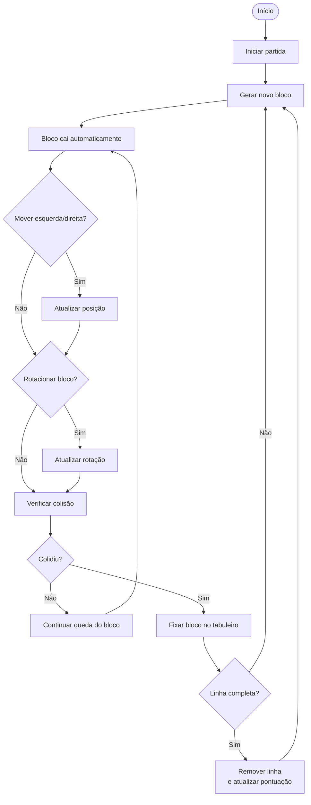

```mermaid
flowchart TD

A([Início]) --> B[Iniciar partida]
B --> C[Gerar novo bloco]
C --> D[Bloco cai automaticamente]

D --> E{Mover esquerda/direita?}
E -->|Sim| F[Atualizar posição]
E -->|Não| G{Rotacionar bloco?}

F --> G

G -->|Sim| H[Atualizar rotação]
G -->|Não| I[Verificar colisão]

H --> I

I --> J{Colidiu?}

J -->|Não| K[Continuar queda do bloco]
K --> D

J -->|Sim| L[Fixar bloco no tabuleiro]
L --> M{Linha completa?}

M -->|Sim| N[Remover linha<br> e atualizar pontuação]
N --> C

M -->|Não| C
```