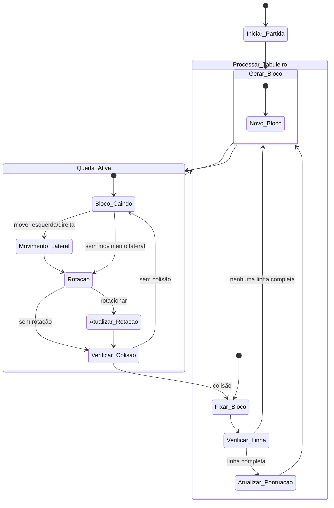

```mermaid
stateDiagram-v2

[*] --> Iniciar_Partida

Iniciar_Partida --> Gerar_Bloco

state Gerar_Bloco {
    [*] --> Novo_Bloco
}

Gerar_Bloco --> Queda_Ativa

state Queda_Ativa {

    [*] --> Bloco_Caindo

    Bloco_Caindo --> Movimento_Lateral : mover esquerda/direita
    Movimento_Lateral --> Rotacao

    Bloco_Caindo --> Rotacao : sem movimento lateral

    Rotacao --> Atualizar_Rotacao : rotacionar
    Rotacao --> Verificar_Colisao : sem rotação

    Atualizar_Rotacao --> Verificar_Colisao

    Verificar_Colisao --> Bloco_Caindo : sem colisão
    Verificar_Colisao --> Fixar_Bloco : colisão
}

Queda_Ativa --> Processar_Tabuleiro

state Processar_Tabuleiro {

    [*] --> Fixar_Bloco

    Fixar_Bloco --> Verificar_Linha

    Verificar_Linha --> Atualizar_Pontuacao : linha completa
    Verificar_Linha --> Gerar_Bloco : nenhuma linha completa

    Atualizar_Pontuacao --> Gerar_Bloco
}

Gerar_Bloco --> Queda_Ativa
```