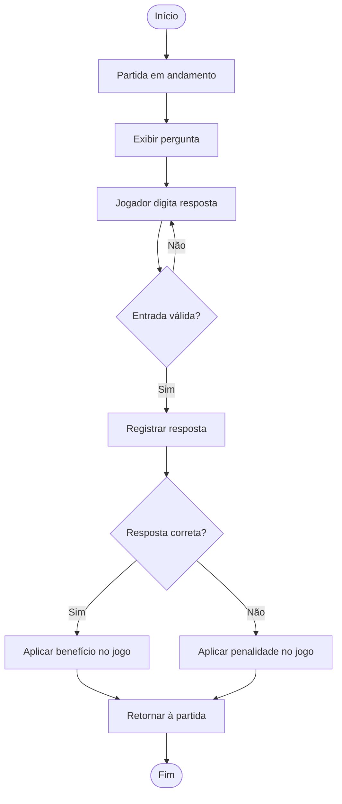

```mermaid
flowchart TD

A([Início]) --> B[Partida em andamento]

B --> C[Exibir pergunta]

C --> D[Jogador digita resposta]

D --> E{Entrada válida?}

E -->|Não| D
E -->|Sim| F[Registrar resposta]

F --> G{Resposta correta?}

G -->|Sim| H[Aplicar benefício no jogo]
G -->|Não| I[Aplicar penalidade no jogo]

H --> J[Retornar à partida]
I --> J

J --> K([Fim])
```