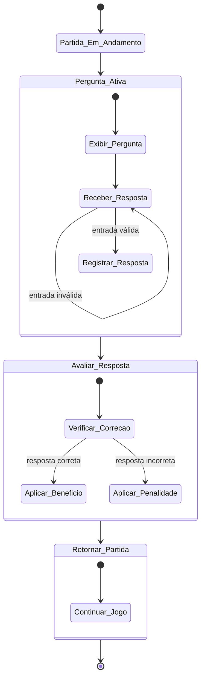

```mermaid
stateDiagram-v2

[*] --> Partida_Em_Andamento

Partida_Em_Andamento --> Pergunta_Ativa

state Pergunta_Ativa {

    [*] --> Exibir_Pergunta

    Exibir_Pergunta --> Receber_Resposta

    Receber_Resposta --> Receber_Resposta : entrada inválida
    Receber_Resposta --> Registrar_Resposta : entrada válida
}

Pergunta_Ativa --> Avaliar_Resposta

state Avaliar_Resposta {

    [*] --> Verificar_Correcao

    Verificar_Correcao --> Aplicar_Beneficio : resposta correta
    Verificar_Correcao --> Aplicar_Penalidade : resposta incorreta
}

Avaliar_Resposta --> Retornar_Partida

state Retornar_Partida {
    [*] --> Continuar_Jogo
}

Retornar_Partida --> [*]
```