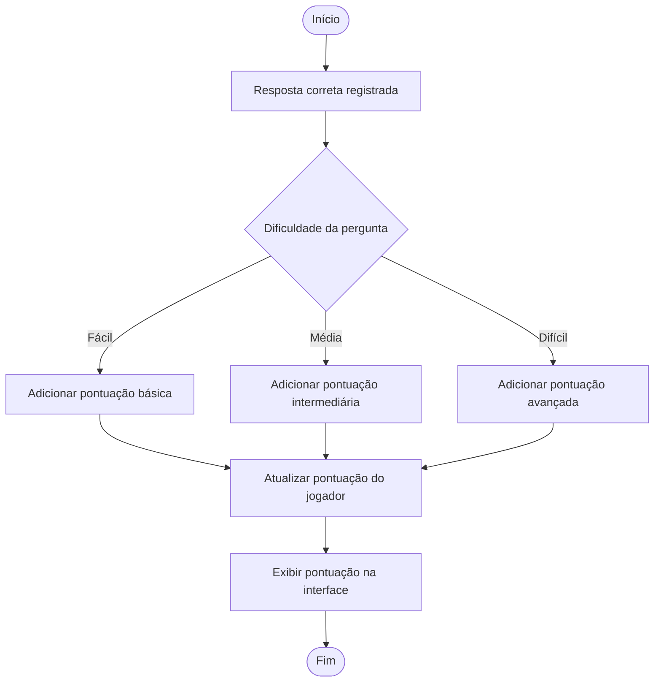

```mermaid
flowchart TD

A([Início]) --> B[Resposta correta registrada]

B --> C{Dificuldade da pergunta}

C -->|Fácil| D[Adicionar pontuação básica]
C -->|Média| E[Adicionar pontuação intermediária]
C -->|Difícil| F[Adicionar pontuação avançada]

D --> G[Atualizar pontuação do jogador]
E --> G
F --> G

G --> H[Exibir pontuação na interface]

H --> I([Fim])
```