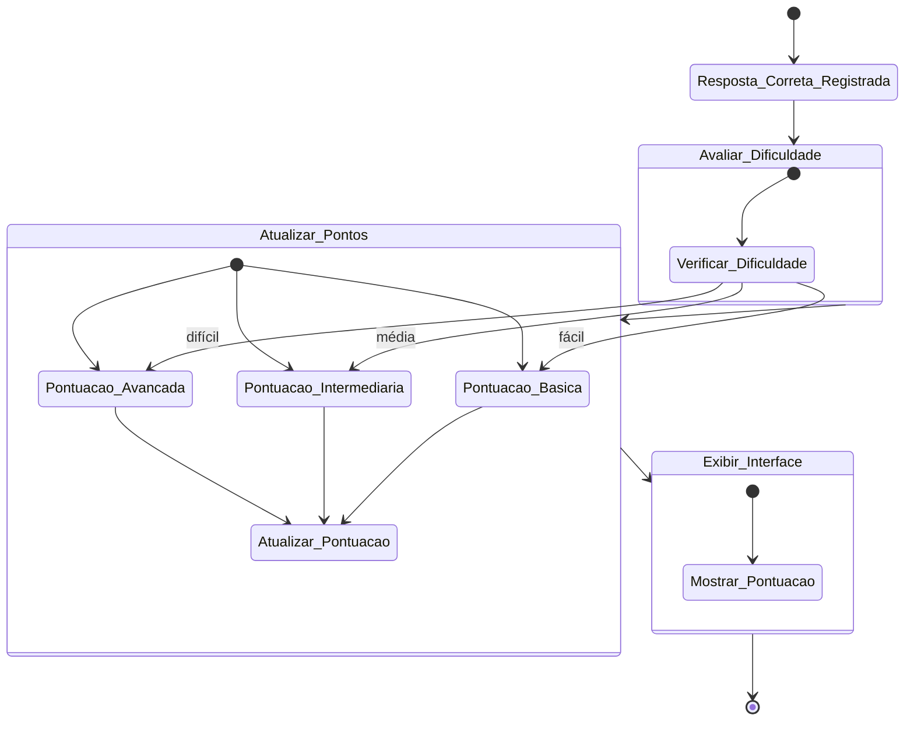

```mermaid
stateDiagram-v2

[*] --> Resposta_Correta_Registrada

Resposta_Correta_Registrada --> Avaliar_Dificuldade

state Avaliar_Dificuldade {

    [*] --> Verificar_Dificuldade

    Verificar_Dificuldade --> Pontuacao_Basica : fácil
    Verificar_Dificuldade --> Pontuacao_Intermediaria : média
    Verificar_Dificuldade --> Pontuacao_Avancada : difícil
}

Avaliar_Dificuldade --> Atualizar_Pontos

state Atualizar_Pontos {

    [*] --> Pontuacao_Basica
    Pontuacao_Basica --> Atualizar_Pontuacao

    [*] --> Pontuacao_Intermediaria
    Pontuacao_Intermediaria --> Atualizar_Pontuacao

    [*] --> Pontuacao_Avancada
    Pontuacao_Avancada --> Atualizar_Pontuacao
}

Atualizar_Pontos --> Exibir_Interface

state Exibir_Interface {
    [*] --> Mostrar_Pontuacao
}

Exibir_Interface --> [*]
```