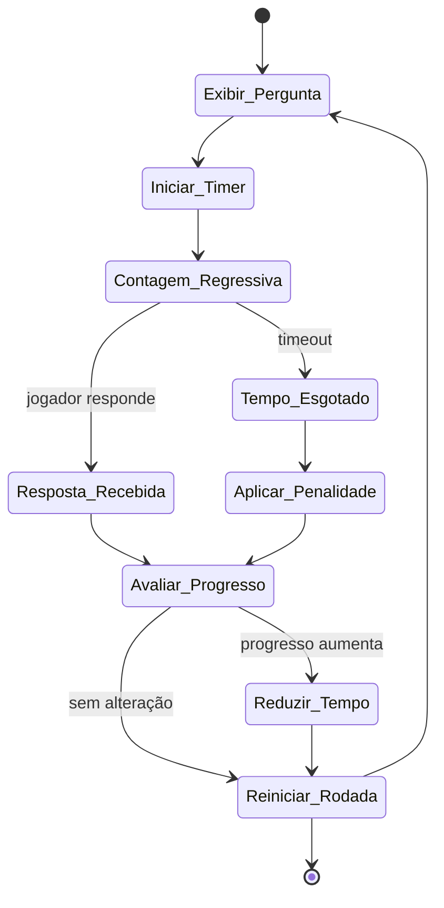

```mermaid
stateDiagram-v2

[*] --> Exibir_Pergunta

Exibir_Pergunta --> Iniciar_Timer

Iniciar_Timer --> Contagem_Regressiva

Contagem_Regressiva --> Resposta_Recebida : jogador responde
Contagem_Regressiva --> Tempo_Esgotado : timeout

Resposta_Recebida --> Avaliar_Progresso

Tempo_Esgotado --> Aplicar_Penalidade
Aplicar_Penalidade --> Avaliar_Progresso

Avaliar_Progresso --> Reduzir_Tempo : progresso aumenta
Avaliar_Progresso --> Reiniciar_Rodada : sem alteração

Reduzir_Tempo --> Reiniciar_Rodada

Reiniciar_Rodada --> Exibir_Pergunta

Reiniciar_Rodada --> [*]
```